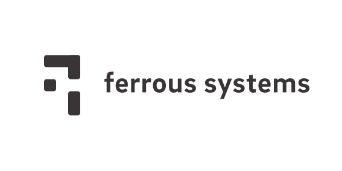

= Rust for Safety
:icons: font
:lecture: Intro
:table-caption!:
:example-caption!:

[.two-col]
== Tyler Neely

- https://github.com/spacejam
- makes and breaks databases and distributed systems
- <3 high performance + high correctness

--
image::sled.svg[400,400]

{empty} +
{empty} +

--

[.two-col]
== Florian Gilcher

- https://github.com/skade
- Rubyist
- Rust community and core teams

TODO: Fill

--

--

[.centered]
== You!

* What do you want to use Rust for?
* Which are the questions that you've always been interested in?
* If you already worked with Rust: what was the hardest part for you?
* With which of the following languages do you identify most?
  - C/C++
  - Objective-C/Swift
  - Haskell/ML
  - Ruby/Python/Perl/Java

[.centered]
== Course goals

In this workshop, you will:

* Get a solid understanding of the basics of Rust
* Learn Safe Rust
* Understand Rust concurrency guarantees
* Understand the role of unsafe Rust
* Understand Rust lifetimes
* Get a glimpse into the possibility Rust opens

[.centered]
== Out of scope

* FFI
* (Advanced) Generics
* `.async/.await`

[.centered]
== Course Structure

* Theory talks
* Exercises
* Spotlight talks to highlight interesting approaches
* Open Q&A

[.centered]
== Exercises

* Building a small protocol parser
* Testing the parser with `proptest`
* Building a small server accepting the protocol
* Make the server threaded/concurrent

[.centered]
== Curiousity

Ask questions! Many of them! As early as possible!

